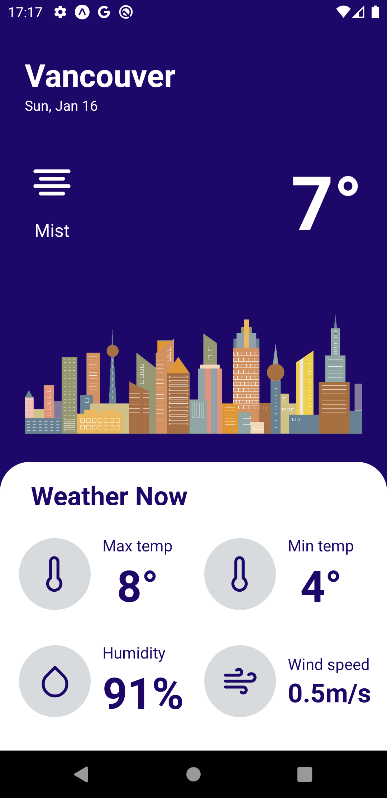
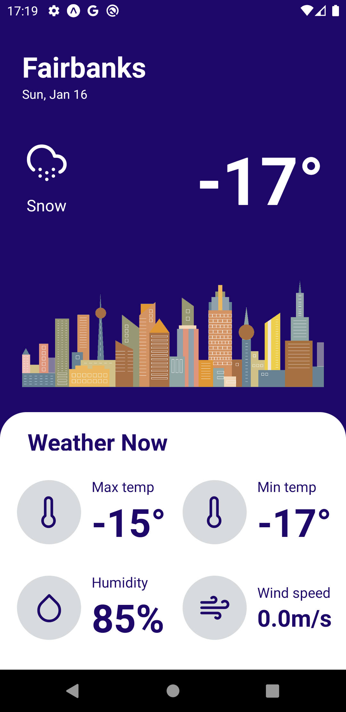
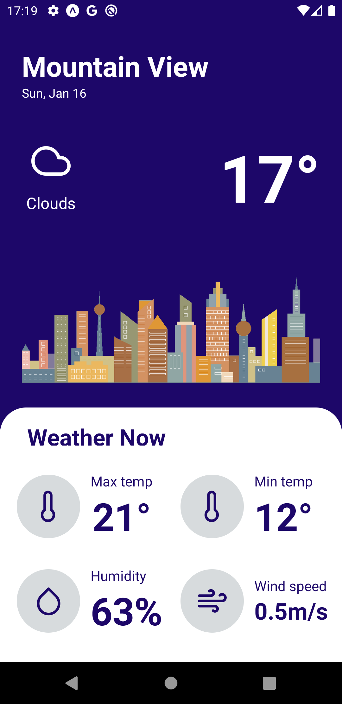

# WeatherApp 🌩
<h4>A react native project, a weather app inspired by a <a href="https://www.youtube.com/watch?v=X2W9MPjrIbk">tutorial</a> from the youtube channel <a href="https://www.youtube.com/c/DesignCodeTeam">DesignCode</a>.</h4>
<h4> The tutorial it's in SwiftUI 🍎, so I tried to recreate it with React Native ⚛</h4>
<h2> Screenshots 📸 </h2>

## ✨ Technologies
- React Native
- Used <a href="https://openweathermap.org/">OpenWeather</a> API.

## 🚀 How to run

- Clone the repository
- Install dependencies with `yarn` or `npm`
- Inicie o servidor com `yarn start` or `npm start`

Access [`localhost:3000`](http://localhost:3000) from your browser.

Note: You might have to configure a new API key at [OpenWeather](https://openweathermap.org/)

